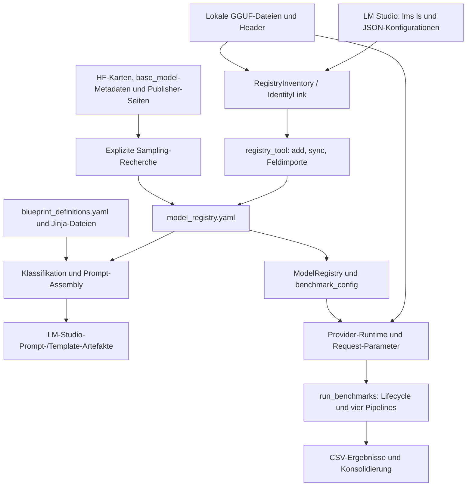

# Code-Review: Registry, Modellidentität und Backend-Grenzen

Datum: 28.09.2026. Reviewer: Codex. Untersucht wurde der aktuelle Arbeitsbaum
auf `main`, HEAD `5fe026bfa8a022676043d664a4d57442bf09d34d`.
Dies ist eine Bestandsreview der angefragten Schnittstellen, keine Review nur
der uncommitteten Dokumentationsänderungen.

**Ergebnis: Änderungen erforderlich.** Zwölf konkrete Befunde wurden durch
14 isolierte Offline-Proben bestätigt. Sechs Befunde sind P1, sechs P2.
Das automatisierte Projekt-Gate ist grün, deckt diese Fälle jedoch nicht ab.
Der in `PLANUNG.md` als abgeschlossen markierte Identitätsvertrag wird noch
nicht von allen Synchronisations- und Laufzeitpfaden eingehalten.

Produktionscode, vorhandene Tests, Registry und externe Backend-Konfigurationen
wurden nicht geändert. Die vorhandenen Änderungen einschließlich `AGENTS.md`
bleiben erhalten. Neu hinzugefügt wurde dieser Bericht; Prüfscripte und
synthetische Eingaben liegen im separaten Codex-Artefaktverzeichnis.

## Projekt und Datenfluss

Das Projekt bereitet lokale Sprachmodelle vor und führt Custom-/Coding-,
EvalPlus-, LM-Eval- und Agentic-Pipelines über eine gemeinsame Provider-Grenze
aus. Die Ergebnisse werden in CSV-Dateien gespeichert und anschließend
konsolidiert. Der Launcher besitzt den Load-/Ready-/Unload-Lifecycle.

Die zentrale Backend-Referenz ist ausschließlich der agentenübergreifende
Skill-Ordner `$HOME/.agents/skills/local-llm-runner`, insbesondere dessen
`SKILL.md`. Die manuelle Änderung der Projekt-`AGENTS.md` wurde berücksichtigt.



| Grenze | Vertrag und aktuelle Umsetzung |
| --- | --- |
| Modellidentität | `publisher/model@quant`; Parser/Builder und allgemeiner Matcher in `src/model_identity.py`. Zusätzlich existieren abweichende Matchingpfade für GGUF, JSON und geladene Instanzen. |
| Technische Fakten | GGUF liefert unter anderem `architecture_family`, `n_layers`, `hidden_dim`, `max_context_length` und `max_experts`. Die Header werden ohne vollständiges Tensor-Mapping gelesen und pro Inventurlauf gecacht. |
| Registry | Maschinenlokale, gitignorierte YAML-Datei; fachliche Quelle für Sampling, Reasoning, Kontext/KV-Werte, Blueprint und ausgewählte Expertenzahl. `experts` ist von der technischen Obergrenze `max_experts` getrennt. |
| Konfigurationsimport | `sync` meldet normale LMS-Settings; `--import-lms-settings` aktiviert den Import. `_materialize_local_bindings()` übernimmt zusätzlich lokale Pfad-/Companion-/Speculative-Bindungen aus eindeutig zugeordneten Runtime-Daten. |
| Quellenzuordnung | `InventorySnapshot`, `ArtifactIdentityEvidence`, `IdentityLink` und `RuntimeBinding` verbinden Registry, GGUF und JSON. Die stärker abgesicherten Join-Regeln werden noch nicht überall verwendet. |
| Webquellen | `sampling_research.py` wird explizit beim Onboarding/Refresh verwendet. Gespeichert werden Kategorieprofile und kompakte Provenienz im gemeinsamen `sampling`-Block; Benchmarkläufe recherchieren nicht im Web. |
| Templates | Native GGUF-Templates, Blueprint-Templates, `template_map` und `template_policy: explicit_file` sind verschiedene Auswahlpfade. Assets umfassen Jinja/Minijinja und Harmony-/Reasoning-spezifische Formate. LMS erhält Template-Inhalt; llama.cpp erhält bei expliziter Policy einen Dateipfad. |
| Reasoning | Registry-Klassifikation, Kategorie-/Thinking-Sampling, Blueprint-Regeln, JSON-Toggle/Budget/Parsing sowie providerabhängige CLI-/Request-Parameter greifen ineinander. Namensheuristiken konkurrieren mit Registry-Daten. |
| Hilfsmodelle | Integriertes MTP benötigt keine zusätzliche Datei; separates MTP und einfache Drafter, DFlash/DFlash2 oder DSpark benötigen unterschiedliche Pairing- und Algorithmusverträge. Normalisierung in `speculative.py`, Bundle-Prüfung in `artifact_bundle.py`, Startargumente in `providers/llama_cpp_args.py`. |

Aktueller Bestand: 69 Registry-Einträge, 39 `thinking`, 30 `instruct`.
19 Einträge besitzen ein lokales Speculative-Profil: acht MTP, sechs DFlash,
vier DSpark und ein einfacher Drafter. Der aktive LMS-Config-Reader findet
85 Konfigurationen; fünf enthalten ein explizites `promptTemplate`, alle als
String. Aktuell gibt es keinen Registry-Eintrag mit `explicit_file`; R08
betrifft eine unterstützte, reproduzierbar fehlerhafte Konfiguration.

## Befunde nach Schweregrad

P1 bedeutet hohe Priorität wegen falscher Modell-/Datenzuordnung oder einer
unwirksamen blockierenden Validierung. P2 sind konkrete Funktionsfehler,
die in den genannten Bedingungen auftreten.

### R01 — P1: Explizite Quantisierung fällt auf eine andere Variante zurück

**Fundstelle:** `src/model_identity.py:577-585`; Verbraucher unter anderem
`src/model_registry.py:329-347` und `src/model_manager.py:488`.

Nach dem fehlgeschlagenen exakten Match entfernt der Matcher die Quantisierung
und übernimmt einen eindeutigen Basistreffer. In der Probe löst
`publisher/model@q6_k` bei einer Registry mit ausschließlich
`publisher/model@q4_k_m` auf die Q4-Variante auf. `ModelRegistry.resolve()`
übernimmt das Ergebnis ohne abschließenden Quantvergleich. Dadurch können
Runtime-Policy, Registry-Key und tatsächliche Variante auseinanderlaufen.

**Korrektur:** Konkrete Quantisierung vor allen Fallbacks parsen und als
verbindliche Einschränkung erhalten. Fehlt der passende Quant, `Unmatched`
zurückgeben. Alias-Matching ohne Quant bleibt nur bei eindeutiger Identität
zulässig. Negativtest zusätzlich über `ModelRegistry` und den Provider-Katalog.

### R02 — P1: GGUF-Sync verliert Publisher und Quantisierung

**Fundstelle:** `src/registry_tool.py:3895-3902`, `3853-3857`; derselbe Ansatz
steht in `cmd_fill_arch()` und der Driftprüfung.

Die Zuordnung wird auf `normalize_model_name(...).split('@')[0]` reduziert.
Eine einzelne vorhandene Datei von `publisher-b/model@q4_k_m` korrigiert damit
auch `publisher-a/model@q6_k`. Die Probe überschreibt dessen 32 Layer und
32768 Kontext mit 64 Layern und 131072 Kontext der fremden Datei. Bei zwei
installierten Quant-Dateien derselben Basis passiert dagegen keine Korrektur:
die komplette Basis wird durch `len(paths) == 1` ausgeschlossen, obwohl jede
vollständige Identität eindeutig ist. Beide Varianten wurden mit tatsächlich
gelesenen synthetischen GGUF-Headern reproduziert.

**Korrektur:** Header über die konkreten `IdentityLink.artifact_evidence`
beziehungsweise vollständige Identitäten zuordnen. Konflikte pro Identität
melden. Die Driftprüfung muss dieselbe Zuordnung verwenden, sonst bestätigt
sie potenziell die falsch importierten Daten.

### R03 — P1: Generationsparameter stammen aus der falschen LMS-Konfiguration

**Fundstelle:** `src/benchmark_config.py:476-477`, `496-540`, zusätzlich `371`.

Vor `decompose_model_identity()` wird `@quant` abgeschnitten;
`requested_quant` bleibt daher immer leer. Der Publisher wird ebenfalls nicht
verbindlich gefiltert: das Requested-Reference-Set enthält den publisherlosen
Modellnamen. Eine Anfrage für `publisher-a/model@q6_k` übernimmt in der Probe
`top_k=77` und `enable_thinking=True` von `publisher-b/model` mit Q4-Datei.
Außerdem nimmt `_lms_index()` pro Modellverzeichnis nur `json_files[0]` auf;
die zweite Probe zeigt zwei vorhandene Quant-JSONs, aber nur einen Indexeintrag.
Ein vermeintlich eindeutiger Treffer kann somit durch unvollständige Inventur
entstehen. Dieser Reader wird auch von gemeinsamen Benchmark-Konfigurationspfaden
benutzt und verwendet die strengeren lokalen GGUF/JSON-Bindungen nicht.

**Korrektur:** Sämtliche aktiven JSONs inventarisieren und die verifizierte
Config-Bindung verwenden. Publisher und Quant vor jeder Parameterübernahme
prüfen; stale, fremde oder mehrdeutige Configs liefern keine Runtime-Werte.

### R09 — P1: HF-Suchergebnisse werden ohne Identitätsnachweis bestätigt

**Fundstelle:** `src/sampling_research.py:610-620`, Übernahme in `923-947`.

Die HF-Suche übernimmt jedes zurückgegebene Repository und dessen `base_model`
in den Quellenpool, ohne dessen Beziehung zum angefragten Modell zu prüfen.
Die höhere Priorität eines solchen Base-Repositories reicht anschließend aus,
um das Profil zu bestätigen. In der Offline-Probe liefert ein Suchtreffer für
eine andere Variante einen anderen Base-Modellnamen; dessen README-Werte
`0.91/0.77` landen als `sampling_research_status: confirmed` beim angefragten
Modell. Plausibilitätsprüfung von Zahlen und Konsistenz innerhalb eines Profils
belegen die Modellzugehörigkeit nicht.

**Korrektur:** Suchtreffer zunächst nur als Kandidaten behandeln. Quellen mit
einem belegten Repository-/Base-Modell-/Publisher- und Variantenbezug zulassen;
unbewiesene Treffer erzeugen `unresolved`. Negative Fixtures für ähnliche
Namen, Finetunes und fremde Base-Repositories ergänzen.

### R10 — P1: `full` kann trotz blockierender Validierungsfehler erfolgreich enden

**Fundstelle:** `src/registry_tool.py:5213-5214`, `_DRIFT_CHECKS` in `4979-4984`.

Der Endstatus berücksichtigt nur `config_experts_drift`,
`runtime_experts_missing`, `runtime_experts_exceed_max` und `gguf_header_drift`.
Andere Blocker wie `local_companion_invalid`, `local_config_pair_invalid`,
`template_missing_file` oder `identity_collision` erscheinen im Report,
führen aber nicht zu Exit 1. Die Probe injiziert einen fehlenden Companion
und eine fehlende Template-Datei in den Validator-Rückgabewert; `cmd_pipeline('full')`
kehrt normal mit Erfolg zurück. Hier wurden die mutierenden Pipeline-Stufen
isoliert gemockt, um ausschließlich die tatsächliche Exit-Code-Logik zu prüfen.

**Korrektur:** `_blocking_validation_errors(errors)` für den Endstatus nutzen.
`--ignore-drift` darf nur die ausdrücklich vorgesehenen Drift-Kategorien
entschärfen. Exit-Code-Tests für jede blockierende Kategorie ergänzen.

### R11 — P1: Eine bereits geladene andere Quantisierung wird weiterverwendet

**Fundstelle:** `src/run_benchmarks.py:2308-2314`, Warnpfad `2335-2342`.

Der Launcher prüft Modellgleichheit per beidseitigem Substring gegen
`identifier` und `model_identifier`. Eine LMS-Instanz mit Basis-ID
`publisher/model`, aber belegter Modellidentität `publisher/model@q4_k_m`,
gilt dadurch auch für die Auswahl `publisher/model@q6_k` als passend.
Die Probe verwendet diese reguläre Form der Provider-Daten: der Launcher
übernimmt die alte Instanz und ruft `load_model()` nullmal auf. Der
Quant-Warnpfad hält die Ausführung nicht an. Ergebnisse können somit mit
der angeforderten Registry-Identität beschriftet werden, obwohl eine andere
Quantisierung inferiert.

**Korrektur:** Geladene Instanz und Auswahl über vollständige, verifizierte
Modellidentität vergleichen. Eine Basis-ID allein belegt die geladene Quant
nicht. Bei Abweichung neu laden beziehungsweise abbrechen und die tatsächlich
geladene Identität vor Benchmarkstart verifizieren.

### R04 — P2: `--thinking` ignoriert Registry-Modelle ohne bekannten Namensmarker

**Fundstelle:** `src/benchmark_config.py:631-639`, Force-Override `700-701`.

`registry_declares_thinking` wird gelesen, aber nicht zur Entscheidung
`is_thinking_model` verwendet. Nur die separate Namensliste aktiviert den
Thinking-Lauf. Die Probe mit `reasoning: thinking`, bestätigtem Thinking-Profil
und neutralem Namen liefert trotz Force-Flag `enable_thinking=False` und das
Coding-Profil `0.12/0.99` statt Thinking `0.93/0.81`.

Im aktuellen Bestand fehlen zehn der 39 Thinking-Namen in dieser Namensliste,
unter anderem Mellum2, Granite 4.2, LFM2.5 und Ternary Bonsai. Das ist ein
nachgewiesener Klassifikationskonflikt; ob das jeweilige Template die gewünschte
API-Steuerung tatsächlich unterstützt, wurde nicht durch GPU-Inferenz geprüft.
Zusätzlich entscheidet die Custom-Pipeline über Template-Kwargs anhand von
`qwen`/`gemma` im Namen, während LM-Eval diese breiter versendet.

**Korrektur:** Registry-Klassifikation und eine gemeinsame Template-/Provider-
Capability verwenden. Force-Modus, Kategorieprofile und tatsächlich mögliche
Thinking-Steuerung getrennt modellieren und in allen Pipelines gleich ableiten.

### R05 — P2: LM Studio erhält den Registry-Kontext nicht beim Laden

**Fundstelle:** `src/model_registry.py:170-176`,
`src/providers/lmstudio_provider.py:355-365`.

Die LMS-Runtime-Ableitung übernimmt nur `num_experts` und explizite Overrides;
der Provider überträgt ebenfalls nur die Expertenzahl. `context_length` wird
an beiden Grenzen verworfen. Die Probe mit Registry-Kontext 32768 erzeugt
eine leere LMS-Runtime und einen Load-Payload ohne Kontext; eine Antwort mit
4096 wird dennoch als erfolgreicher Load akzeptiert. Request-/Tokenplanung
kann so von einer anderen Kontextgröße ausgehen als das geladene Modell.

**Korrektur:** Den technisch begrenzten Registry-Kontext in die LMS-Runtime
und das Load-Payload übernehmen und die Echo-Konfiguration prüfen.
Die [offizielle LMS-Load-API](https://lmstudio.ai/docs/developer/rest/load)
unterstützt `context_length`; die fehlende Übertragung ist daher keine
API-bedingte Einschränkung. Nicht verfügbare KV-/Session-API-Felder benötigen
eine gesonderte, ausdrücklich dokumentierte Artefaktgrenze.

### R06 — P2: Reguläre kleinere Drafter werden vorab verworfen

**Fundstelle:** `src/artifact_bundle.py:171-172`, `181-185`.

Die Simple-Draft-Prüfung verlangt `draft` im Dateinamen und anschließend für
alle Companion-Typen gleiche namensbasierte Parametergrößen. Die Probe mit
`Llama-3.2-3B-Instruct` und `Llama-3.2-1B-Instruct` meldet sowohl fehlenden
Draft-Dateinamensmarker als auch `main=3B, companion=1B`.
Damit werden normale kleinere LLMs als Drafter ausgeschlossen, bevor ihre
Tokenizer-/Runtime-Kompatibilität überhaupt geprüft wird. Die Probe behauptet
keine erfolgreiche Inferenz dieser synthetischen Dateien.

**Korrektur:** Simple Draft als eigenständiges kleineres Sprachmodell behandeln;
die deklarierte Rolle darf keine Umbenennung der GGUF-Datei verlangen.
Tokenizer-/Vokabular- und Backend-Kompatibilität prüfen. Zielgebundene MTP-/
DFlash-/DSpark-Verträge getrennt behandeln. Die
[offizielle llama.cpp-Dokumentation](https://github.com/ggml-org/llama.cpp/blob/master/docs/speculative.md)
beschreibt kleinere gewöhnliche Draft-Modelle ausdrücklich.

### R07 — P2: DFlash- und DSpark-Methode werden nicht gegeneinander geprüft

**Fundstelle:** `src/artifact_bundle.py:165-169`.

Für `method: dflash` und `method: dspark` reicht irgendein erkannter
DFlash-/DSpark-Dateinamensmarker. `helper_kind` muss nicht mit `method`
übereinstimmen. Ein DSpark-benannter Helper erhält in der DFlash-Probe keine
Validierungsfehler. Darüber hinaus prüft dieser Validator nur das GGUF-Magic,
nicht die deklarierte Architektur oder zielgebundene Header-Fakten.

**Korrektur:** Aus Headern oder validierter Pairing-Deklaration eine typisierte
Capability ableiten; ausgewählte Methode und nachgewiesene Helper-Capability
müssen kompatibel sein. DFlash und DSpark haben unterschiedliche Algorithmen,
wie die [offizielle Beschreibung](https://github.com/ggml-org/llama.cpp/blob/master/docs/speculative.md)
und die [Implementierung](https://github.com/ggml-org/llama.cpp/blob/master/common/speculative.cpp)
zeigen. Eine behauptete automatische Korrektur durch eine konkrete lokale
Backend-Version wurde hier nicht getestet.

### R08 — P2: Prompt-Assembly überschreibt eine explizite Template-Policy

**Fundstelle:** `src/assemble_blueprint.py:1409`, Übernahme `1427-1430`.

Registry-Template-Sync und direkte Runtime berücksichtigen `explicit_file`.
`assemble_prompts()` wählt dagegen immer zuerst das Blueprint-Template.
Die Probe enthält ein explizites Template, ein anderes Blueprint-Template
und einen eindeutigen `IdentityLink`; die Assembly ersetzt den expliziten
LMS-Inhalt durch `BLUEPRINT_TEMPLATE`. Eine angekündigte gemeinsame Policy
wird dadurch je nach Schreib-/Runtimepfad unterschiedlich umgesetzt.

**Korrektur:** Eine gemeinsame Template-Auflösung mit derselben Priorität für
Sync, Assembly, Validierung und Runtime verwenden. Regression mit
`explicit_file` plus konkurrierendem Blueprint-Template ergänzen. Im aktuellen
Registry-Bestand ist diese spezielle Policy noch nicht konfiguriert.

### R12 — P2: `fill-reasoning` ergänzt fehlendes Reasoning nicht

**Fundstelle:** `src/registry_tool.py:4063-4079`.

`unique` enthält `base -> Dateipfad`, `gguf_reasoning` dagegen `base -> bool`.
Der Code benutzt den aus `unique` geholten Dateipfad als Schlüssel im zweiten
Dictionary; normale Treffer werden dadurch verworfen. Zudem fehlt nach der
Schleife ein `save_registry()`. Die Probe mit lesbarem Thinking-Header und
vorhandenen Layer-/Dimensionswerten hinterlässt die Registry ohne Reasoning.
Gerade nach dem Skip in `fill-arch` soll dieser Fallback die Lücke schließen.

**Korrektur:** Reasoning anhand derselben eindeutig belegten Artefaktidentität
auflösen und Änderungen speichern. Test muss den Registry-Inhalt nach erneutem
Lesen prüfen, nicht nur Zähler oder Konsolenausgabe.

## Nachweise und Grenzen

Prüfumgebung: native Windows-PowerShell, vorhandenes Python 3.12.10;
kein neuer Interpreter und keine Paketinstallation. Kein Backend wurde für
diese Review geladen, entladen oder umkonfiguriert. Die Backend-Verträge für
LMS-Kontext und gewöhnliche versus spezialisierte Drafter wurden zusätzlich
an den oben verlinkten offiziellen Quellen geprüft.

| Prüfung | Ergebnis |
| --- | --- |
| `pre_review_checks.ps1 -NoTranscript -NoArtifacts` | Erster Lauf scheitert in der Test-Collection wegen geerbtem `LLM_PROVIDER` mit EXE-Pfad. Zweiter Lauf mit prozesslokalem `LLM_PROVIDER=lmstudio` besteht sämtliche blockierenden Gate-Prüfungen. |
| Vollständige bestehende Pytest-Suite | 1184 passed in 104.07 Sekunden. |
| Ruff-Gate | 0 Probleme. |
| Registry `validate --ci` | 0 blockierende Probleme, 0 Hinweise. Dieser Modus prüft keine lokalen GGUF-/Config-/Companion-Bindungen. |
| GGUF-Check des Gates | 0 Abweichungen bei 52 gematchten Registry-Einträgen; kein Nachweis für alle 69 Einträge. Auch der Gate-Check verwendet einen vereinfachten Basis-Match. |
| Fokussierter mypy-Scope | `python -m mypy --follow-imports=silent src/benchmark_config.py src/csv_writer.py`: erfolgreich. |
| Vollbaum-mypy | Stoppt an Syntaxfehler `utils/convert_hf_to_gguf_update.py:152`, Zeichen U+00B7. Laut Projektregeln ist `utils/` fremder Code; dies ist kein zusätzlicher Befund dieser Review. |
| Isolierte Review-Proben | 14/14 bestätigen die beschriebenen Fehlerbedingungen. R02 und R03 besitzen jeweils zwei Proben, sonst eine pro Befund. |
| Änderungen an `src/` und `tests/` | Keine; `git diff --name-only -- src tests` bleibt leer. |
| Whitespace-Prüfung des vorhandenen Diffs | `git diff --check` meldet bestehende Whitespace-Stellen in der manuell geänderten `AGENTS.md`; diese wurden nicht bearbeitet. |

Das Prüfscript liegt unter
`$HOME/.codex/visualizations/2026/09/28/01a0e7a3-f2b2-76f3-8dc5-0b7fb25695f0/registry_review_probes.py`;
die gleichnamige JSON-Datei enthält die beobachteten Resultate. Aus dem
Projektroot reproduzierbar mit:

```powershell
$env:PYTHONDONTWRITEBYTECODE = '1'
python "$HOME/.codex/visualizations/2026/09/28/01a0e7a3-f2b2-76f3-8dc5-0b7fb25695f0/registry_review_probes.py"
```

Das Script erstellt für jeden Lauf einen neuen synthetischen Fixture-Ordner
neben sich; es patcht mutierende Pipeline-Stufen beziehungsweise lenkt direkte
Dateischreibvorgänge auf diese Fixtures. Sein Exit-Code 0 bedeutet, dass alle
Fehlerbedingungen reproduziert wurden, nicht dass sie behoben sind.

Es gab keinen Live-Benchmark, keinen Modellvergleich mit Tokens/s-/VRAM-Messung
und keine vollständige Einzelmodell-Abnahme gegen sämtliche Webquellen.
Vorhandene positive Tests und frühere SampleSize-1-Smokes sind deshalb mit
den hier bestätigten negativen Grenzfällen vereinbar.

## Empfohlene Reihenfolge der Korrekturen

1. R01/R02/R03/R11: Vollständige Identität durch Matching, Header-Sync,
   JSON-Import und Load-Verifikation erhalten. Den vorhandenen `IdentityLink`
   als verbindliche Grenze verwenden, statt weitere unabhängige Heuristiken
   hinzuzufügen.
2. R10: Den blockierenden Endstatus vereinheitlichen, damit alle folgenden
   negativen Tests zuverlässig scheitern, wenn ihre Vertragsverletzung offen ist.
3. R04/R05/R08/R12: Reasoning-, Kontext- und Template-Ableitung in gemeinsame
   Resolver führen und mit den tatsächlichen Provider-/Request-Ausgaben prüfen.
4. R06/R07: Typabhängige Companion-Verträge mit Header-/Pairing-Evidenz
   etablieren; gewöhnliche Drafter und zielgebundene Helfer getrennt validieren.
5. R09: Webevidenz an nachgewiesene Modellidentität binden; erst danach
   betroffene Sampling-Profile gezielt erneut recherchieren.

Die vorhandenen abstrahierten Grenzen sind dafür geeignet. Eine vollständige
Neugestaltung der Registry ist aus den Befunden nicht erforderlich; zuerst
sollten die verbliebenen Umgehungen dieser Grenzen geschlossen werden.
