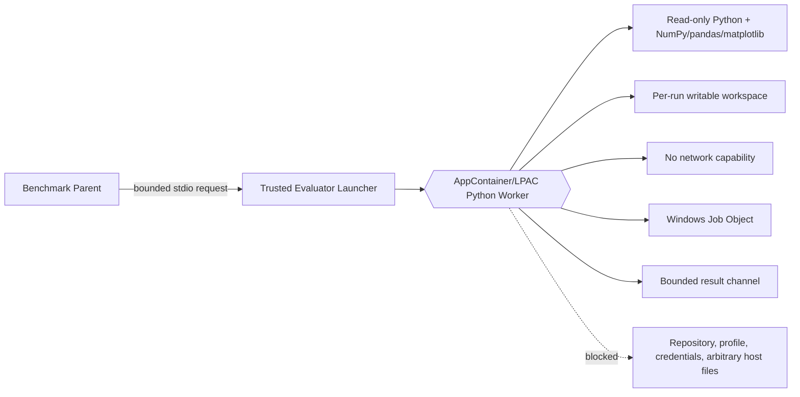

# Planung: AppContainer/LPAC-Evaluator für Coding-Benchmarks

## Entscheidung

Wir behalten NumPy, pandas und matplotlib als verpflichtende Bestandteile der
Coding-Benchmarks. Wir verwenden keinen separaten Windows-Benutzer und planen
keinen Remote-LM-Eval-Zugriff. Als bevorzugte nächste Architektur prüfen wir
deshalb einen direkt gestarteten AppContainer- beziehungsweise LPAC-Worker,
der den bestehenden Python-Evaluator ausführt.

Windows Sandbox und die Hyper-V-Rolle sind unter Windows 11 Home offiziell
nicht verfügbar. Sie sind daher keine Grundlage für die Standardlösung auf
diesem Rechner. AppContainer ist eine Windows-Prozess- und
Ressourcenisolation, die nicht auf der Hyper-V-Rolle beruht; ob der konkrete
Python- und Scientific-Stack in der gewünschten Form funktioniert, wird in
einem isolierten Machbarkeitsspike geprüft, bevor der Benchmark-Standardpfad
umgestellt wird.

## Executive Recommendation

Wir sollten **Option 1: direkter AppContainer/LPAC-Worker mit nativer
Launcher-Komponente** als Zielvariante untersuchen. Der Worker erhält eine
eigene AppContainer-Identität, aber keinen separaten Benutzeraccount. Der
AppContainer erhält keine Netzwerk-Capability, nur Read-only-Zugriff auf den
Python-/Scientific-Stack und Read/Write-Zugriff auf ein pro Lauf erzeugtes
Arbeitsverzeichnis.

**Option 2: MSIX-gepackter AppContainer** wäre technisch stärker in die
Windows-Paketidentität integriert, würde aber Packaging, Signierung,
Installation und Updateprozess für dieses Python-Projekt deutlich
komplizieren. **Option 3: taktische In-Process-Sandbox** bleibt nur ein
Kompatibilitäts- oder Notfallpfad; sie schließt Finding 1 nicht vollständig.

## Evidenz

| Evidenz | Feststellung | Bedeutung für die Planung |
|---|---|---|
| `csf_57dcc81118eb3aba784ea723` — native-loader Escape | Allowlisted Scientific Packages erreichen generierten `exec()`-Code; Job Objects ändern nicht die Identität oder Dateirechte. | NumPy-Kompatibilität darf nicht durch blindes Freigeben beliebiger Loader erkauft werden; die OS-Grenze muss den Restschaden begrenzen. |
| `csf_3b9d51bdd18255fa689920a9` — EvalPlus memory enforcement | Windows verlor die ursprüngliche Speicherüberwachung. | Custom Benchmark und EvalPlus brauchen einen gemeinsamen Worker mit Job-Object-Grenzen. |
| Microsoft Learn — AppContainer/LPAC | AppContainer nutzt SIDs, Capabilities und DACLs; LPAC verlangt noch explizitere Freigaben. | Eine separate Windows-Identität ist nicht erforderlich, aber ein eigener Prozess-Token und passende ACLs sind erforderlich. |
| Microsoft Learn — Windows Sandbox/Hyper-V | Windows Sandbox wird auf Windows Home nicht unterstützt; die Hyper-V-Rolle kann auf Windows 11 Home nicht installiert werden. | VM-/Sandbox-Varianten sind für die Standardinstallation ausgeschlossen. |

Ich habe die betroffenen Evaluatorpfade und die bestehende Job-Object-
Implementierung im Projekt geprüft. Die wichtige Schlussfolgerung ist: Die
Scientific Libraries bleiben möglich, wenn ihre bekannten Runtime-Dateien
Read-only zugänglich sind; sie dürfen aber nicht automatisch allgemeine
Datei-, Netzwerk- oder native Loader-Rechte erhalten.

## Aktuelles Design und Zielzustand

Heute entscheidet die Python-Allowlist, welche Module generierter Code direkt
verwenden darf. Das schützt gegen bekannte Loader-Aufrufe, ist aber keine
Sicherheitsgrenze für den Interpreter und seine Abhängigkeiten.

Künftig bleibt der Python-Code innerhalb des Workers kompatibel, aber der
Worker selbst startet unter einer AppContainer-/LPAC-Identität:

Der Parent-Prozess kommuniziert über stdio oder eine explizit ACL-geschützte
Named Pipe, nicht über den Netzwerk-Stack. Der Worker erhält weder
LM-Eval-Credentials noch Provider-Konfigurationen. LM Studio und Unsloth
bleiben außerhalb des Workers; LM-Eval bleibt loopback-only.

## Gewünschte Invarianten

- NumPy, pandas und matplotlib können typische Coding-Benchmark-Aufgaben
  ausführen, einschließlich des Schreibens erlaubter Plot-/Ergebnisdateien.
- Generierter Code kann außerhalb seines zugewiesenen Arbeitsverzeichnisses
  keine Dateien lesen oder schreiben.
- Generierter Code kann weder Benutzerprofil, Repository, Secrets noch
  Provider-Konfigurationen lesen.
- Der Worker besitzt keine Netzwerk-Capability und kann weder lokale noch
  externe LM-Eval-/LLM-Endpunkte erreichen.
- Native DLLs, die zum freigegebenen Scientific-Stack gehören, können aus
  Read-only-Pfaden geladen werden; beliebiges Nachladen aus fremden Pfaden
  bleibt blockiert.
- Speicher, Laufzeit, Prozessanzahl, Ausgabegröße und Prozessbaum bleiben
  durch das Job Object und den IPC-Adapter begrenzt.
- Wenn AppContainer/LPAC auf dem konkreten System nicht sicher gestartet
  werden kann, fällt der Produktivpfad nicht automatisch auf die unsichere
  In-Process-Variante zurück, sondern bricht mit einer verständlichen
  Diagnose ab.

## Plattformbewertung: Windows 11 Home

| Variante | Windows 11 Home | Bewertung |
|---|---|---|
| Hyper-V-Rolle | Offiziell nicht installierbar | Nicht als Standardlösung verwenden. |
| Windows Sandbox | Offiziell nicht unterstützt | Nicht als Standardlösung verwenden. |
| AppContainer/LPAC | Windows-Prozessmechanismus; konkrete Python-Nutzung muss geprüft werden | Bevorzugter Machbarkeitsspike. |
| MSIX-AppContainer | Grundsätzlich möglich, aber Packaging-/Signierungsaufwand | Reservevariante, falls direkter Start scheitert. |
| WSL2/VM/third-party container | Nicht gleichwertig zu AppContainer; zusätzliche Integrations- und Mount-Risiken | Nicht erste Wahl für dieses Projekt. |

„Kein separater Nutzer“ bleibt dabei erhalten: AppContainer/LPAC verwendet
keinen neu anzulegenden lokalen Account. Es verwendet einen zusätzlichen,
prozessbezogenen Sicherheitskontext mit Package-/Capability-SIDs und
entsprechenden DACLs.

## Optionen

### Option 1: Direkter AppContainer/LPAC-Worker

Eine kleine vertrauenswürdige Launcher-Komponente erstellt beziehungsweise
verwendet ein AppContainer-Profil, baut die Security-Capability-Struktur auf
und startet den Python-Prozess mit `STARTUPINFOEX` und den Windows-
Security-Capabilities. Der Python-Prozess wird anschließend wie bisher dem
Job Object zugeordnet.

Die Runtime wird nicht schreibbar in das Projekt eingebunden. Entweder erhält
der AppContainer Read-only-Rechte auf die vorhandene Python-Umgebung, oder die
notwendigen Interpreter- und Paketdateien werden in einen dedizierten
Read-only-Runtime-Pfad staged. Das Machbarkeitsexperiment muss beide Varianten
gegen NumPy, pandas und matplotlib prüfen.

Für matplotlib werden Cache- und Konfigurationspfade in das pro Lauf
erzeugte Arbeitsverzeichnis gelegt. Auch temporäre Dateien, Font-Caches und
Plot-Ausgaben müssen dort landen. Der AppContainer erhält keine
`internetClient`- oder `privateNetworkClientServer`-Capability.

Was mich an dieser Variante vorsichtig macht, ist nicht die Windows-
Identität, sondern die Kompatibilität des unmodifizierten Python-Interpreters
mit AppContainer-Dateirechten und nativen DLL-Abhängigkeiten. Genau deshalb
kommt zuerst ein separater Spike und erst danach die Umstellung des
Produktivpfads.

### Option 2: MSIX-gepackter AppContainer

Der Evaluator wird als MSIX-Anwendung mit AppContainer-TrustLevel verpackt.
Die Python-Runtime und Scientific Libraries liegen im read-only Package;
Arbeitsdaten werden über die vorgesehenen AppContainer-Pfade oder einen
Broker übergeben.

Das ist attraktiv, wenn aus dem Evaluator später ein verteilbares Windows-
Produkt werden soll. Für das bestehende lokale Benchmarkprojekt entstehen
jedoch Package-Identität, Signierung, Installation, Update und Debugging als
zusätzliche Betriebsflächen. Diese Variante wird erst relevant, wenn Option 1
am direkten Prozessstart oder an der Rechtevergabe scheitert.

### Option 3: Taktischer In-Process-Pfad

Die aktuelle Allowlist, die Blockade bekannter Loader und das Job Object
bleiben aktiv. Diese Variante erhält die höchste Kompatibilität und den
geringsten Integrationsaufwand, ist aber keine vollständige OS-Sicherheits-
grenze. Sie darf nur als expliziter Entwicklungs-/Diagnosemodus bestehen und
nicht als stiller Fallback für den sicheren Produktivbetrieb.

## Vergleich

| Dimension | Option 1: direkter AppContainer | Option 2: MSIX-AppContainer | Option 3: taktisch |
|---|---|---|---|
| Sicherheit | Hoch, sofern ACLs/Capabilities korrekt und getestet sind | Hoch, plus Package-Integrität | Bekannte Pfade reduziert, Interpreter bleibt privilegierter |
| NumPy-Kompatibilität | Muss im Spike nachgewiesen werden | Gut kontrollierbar, aber Packaging-sensitive | Am höchsten |
| Performance | Prozess-/IPC-Overhead, messbar | zusätzlicher Package-/Broker-Overhead möglich | nahe am aktuellen Verhalten |
| Betrieb | Launcher, ACLs und Selbsttests | Packaging, Signierung und Updates | gering |
| Windows Home | Zielvariante, zu verifizieren | Reservevariante, zu verifizieren | verfügbar |
| Rollback | expliziter taktischer Diagnosemodus | zurück zum direkten Launcher oder taktischen Modus | einfach, aber Sicherheitsrisiko |

## Empfohlener Machbarkeitsspike

Der Spike verändert zunächst keinen Standard-Benchmarklauf. Er soll auf dem
konkreten Windows-11-Home-System eine minimale AppContainer-Instanz starten
und die folgenden Ergebnisse als Testartefakte erfassen:

1. Windows-Edition, Build, Architektur und Virtualisierungsstatus erfassen.
2. AppContainer-/LPAC-Profil mit leerer Netzwerk-Capability anlegen.
3. Trusted Launcher und Python-Worker mit explizitem Security-Token starten.
4. Zugriff auf erlaubte Read-only-Pfade und das temporäre Arbeitsverzeichnis
   prüfen.
5. Zugriffe auf Repository, Benutzerprofil, Secrets, Registry und Netzwerk
   negativ testen.
6. `import numpy`, `import pandas`, `import matplotlib` sowie typische
   Array-, DataFrame- und Plot-Aufgaben ausführen.
7. Native DLL-Imports des freigegebenen Stacks prüfen, aber beliebiges
   `ctypes`-/`load_library`-Nachladen weiterhin ablehnen.
8. Child-Prozesse, große Ausgaben, Speicherallokation, Timeout und Cleanup
   mit dem Job Object prüfen.
9. Cold-start, Warm-start, Durchsatz, p95-Latenz und Peak-RSS gegen den
   aktuellen taktischen Runner messen.

Der Spike gilt nur dann als bestanden, wenn sowohl die Negativtests als auch
die drei Scientific-Library-Kompatibilitätstests erfolgreich sind.

## Umsetzungsphasen nach bestandenem Spike

### Phase 1: Vertrauenswürdiger Launcher

- Launcher-Schnittstelle und Startparameter definieren.
- AppContainer-/LPAC-Profilverwaltung implementieren.
- Capability-Liste standardmäßig leer halten.
- AppContainer-SID/Capability-SID nur für die vorgesehenen Pfade in DACLs
  eintragen.
- Keine Handle-Vererbung und bereinigte Environment-Variablen verwenden.
- Prozess vor Resume dem Job Object zuordnen.

### Phase 2: Runtime- und Arbeitsverzeichnis

- Python, NumPy, pandas und matplotlib in einen bekannten Read-only-Pfad
  bringen oder sicher Read-only freigeben.
- Pro Lauf ein zufälliges Input-/Output-/Temp-Verzeichnis anlegen.
- `MPLCONFIGDIR` und vergleichbare Cachevariablen auf dieses Verzeichnis
  setzen.
- Nur serialisierte Eingaben und begrenzte Ergebnisse über stdio/IPC
  übertragen.

### Phase 3: Gemeinsame Evaluator-Anbindung

- Custom Benchmark und EvalPlus an denselben Launcher-Adapter anbinden.
- Aktuelle taktische Importblockaden und Job-Object-Limits während der
  Migration beibehalten.
- Sicheren AppContainer-Pfad standardmäßig aktivieren.
- Bei fehlender Plattformfähigkeit fail-closed abbrechen; kein stiller
  Wechsel auf den unisolierten Pfad.

### Phase 4: Abnahme und Rollout

- Coding-Benchmark-Korpus auf Score-Parität und Kompatibilität prüfen.
- Escape-, Ressourcen- und Lifecycle-Tests in die Windows-Testmatrix aufnehmen.
- Zunächst kleine Fixture-Menge, anschließend vollständige Coding-Benchmarks.
- Rollback nur auf den dokumentierten taktischen Diagnosemodus mit sichtbarer
  Warnung und expliziter Aktivierung erlauben.

## Akzeptanzkriterien

- NumPy, pandas und matplotlib funktionieren in repräsentativen Coding-
  Benchmark-Fixtures.
- Native Scientific-DLLs funktionieren nur aus den freigegebenen
  Read-only-Pfaden.
- Kein Zugriff auf Repository, Benutzerprofil, Credentials oder Netzwerk.
- Job Object beendet Worker und Kinder bei Timeout, Speicher- oder
  Prozesslimit.
- Parent-Abbruch hinterlässt keine laufenden Worker und keine unbereinigten
  temporären Artefakte.
- LM-Eval bleibt ausschließlich loopback-only.
- Unter Windows 11 Home ist der sichere Pfad entweder erfolgreich aktiv oder
  der Lauf wird mit einer klaren Unsupported-/Setup-Diagnose abgelehnt.

## Offene Restfragen

- Welche konkrete Windows-11-Home-Build-/SDK-Kombination wird unterstützt?
- Kann der vorhandene Python-/Scientific-Stack direkt read-only verwendet
  werden, oder muss eine staged Runtime erstellt werden?
- Welche Startup-, RSS- und p95-Schwellenwerte sind für Coding-Benchmarks
  akzeptabel?
- Benötigen einzelne vorhandene Fixtures Schreibzugriff außerhalb des
  per-run-Arbeitsverzeichnisses? Falls ja, müssen sie angepasst werden, nicht
  die Isolation pauschal erweitert werden.

## Microsoft-Basisdokumentation

- [Launch an AppContainer](https://learn.microsoft.com/en-us/windows/win32/secauthz/implementing-an-appcontainer)
- [AppContainer isolation](https://learn.microsoft.com/en-us/windows/win32/secauthz/appcontainer-isolation)
- [Windows Sandbox](https://learn.microsoft.com/en-us/windows/security/application-security/application-isolation/windows-sandbox/)
- [Install Hyper-V in Windows](https://learn.microsoft.com/en-us/windows-server/virtualization/hyper-v/get-started/Install-Hyper-V)
