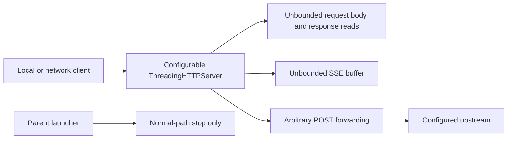
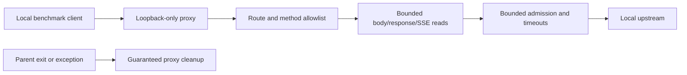
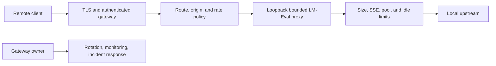

# Security Hardening Proposal: Bounded local LM-Eval proxy

## Decision

We should make the proxy's safety properties explicit instead of relying on `127.0.0.1` as a default and normal completion as a cleanup mechanism. I recommend Option 1, loopback-only bounded operation, because the repository's normal launcher is local and no remote-client requirement has been supplied. Option 2 remains available if remote use is a real requirement.

## Executive Recommendation

**Option 1: Loopback-only bounded proxy** rejects non-loopback binds, forwards only the required LM-Eval routes, caps bodies/responses/SSE events, bounds concurrency, disables wildcard CORS, and guarantees cleanup. **Option 2: Authenticated remote gateway** adds TLS, client authentication, rate limits, and operational ownership for remote clients while retaining every local bound. Option 1 is the proportionate default; Option 2 should be selected only with a concrete remote use case and an owner for certificates, credentials, monitoring, and incident response.

## Evidence

| Evidence | Finding | What it establishes |
| --- | --- | --- |
| `csf_93aa4dc792063d79c336499b` | LM-Eval proxy leaves request, response, buffering, and concurrency resources unbounded | `Content-Length` drives an unbounded read, responses are fully read, streaming buffers grow until a delimiter, and `ThreadingHTTPServer` has no admission limit. |

I inspected `src/tools/lmeval_proxy.py:38-199` and `src/run_benchmarks.py:346-357,2162-2166,2200-2205`. The structural issue is that the proxy is both a network boundary and a throughput component, but neither role has an explicit policy owner. If we add limits only to one code path, arbitrary forwarding or a future bind override can reintroduce the same exposure.

## Current Design And Failure Mode

The proxy accepts a configurable bind address and forwards chat and other POST paths to a configurable upstream. It reads the request body based on client-supplied `Content-Length`, fully materializes non-streaming responses, grows an SSE buffer until `\n\n`, and creates request threads without a pool. The parent stops the proxy only on the normal main path; its `atexit` handler releases the single-instance lock but does not stop the child.

## Desired Invariants

- The normal proxy cannot bind beyond loopback.
- Only the exact methods and routes needed by LM-Eval are forwarded.
- Request bodies, responses, SSE events, connections, and worker slots have explicit bounds.
- Slow clients and upstreams cannot retain resources indefinitely.
- Parent exit, exception, and interruption remove the proxy listener.
- Health output and logs do not expose credential-bearing or sensitive upstream URLs.

## Constraints And Non-Goals

We are not designing a general internet-facing inference gateway under Option 1. We preserve the current local benchmark workflow and treat remote use as a separate deployment. We will not choose arbitrary limits without measuring real model response sizes and concurrency. The plan also does not attempt to solve upstream server authorization; it prevents this proxy from becoming an accidental unauthenticated gateway.

## Before Architecture

The default bind is local, but the code does not enforce that as a security invariant. The same handler therefore becomes much more dangerous when a wrapper supplies a non-loopback address.

## Options

### Option 1: Loopback-only bounded proxy

We reject any non-loopback bind in the normal proxy, keep the command-line option only as an explicit development error or remove it, and allowlist `/v1/models` and `/v1/chat/completions` with the required methods. We add maximum body and response sizes, maximum SSE event size, idle/read timeouts, and a bounded admission pool. We register `_stop_lmeval_proxy` with `atexit`, wrap the main lifecycle in `try/finally`, and remove wildcard CORS because the normal client is a local process rather than a browser.

The attractive part is that this option matches the observed product boundary. It does not add authentication ceremony to a local-only helper, and it keeps the hot path close to the current implementation. The key is to enforce the local boundary rather than merely document it. We should also make limit failures observable through reason codes without logging request bodies or secrets.

| Change | Before | After | Security consequence | Cost |
| --- | --- | --- | --- | --- |
| Bind | Configurable interface | Loopback enforced | Removes accidental network exposure | Remote ad-hoc use no longer works |
| Forwarding | Arbitrary POST paths | Required routes only | Removes management-route forwarding | Small compatibility review |
| Resources | Client-sized/unbounded | Explicit body, response, event, pool, idle limits | Prevents memory/thread exhaustion | Tuning and rejection behavior |
| Lifecycle | Normal stop only | `atexit` plus `try/finally` | Reduces orphan listeners | Cleanup tests |

Option 1 is my recommendation under the current assumptions. Option 2 should win if remote clients are a product requirement rather than a convenience.

### Option 2: Authenticated remote gateway

We retain the bounded local core but put remote access behind TLS and explicit client authentication, with route authorization, rate limits, origin policy, credential rotation, and an operational owner. The Python proxy can remain loopback-only while a maintained gateway handles the remote boundary; alternatively, the proxy itself can implement the controls if that is the chosen deployment owner.

The strongest case is controlled remote collaboration: identity and policy are explicit rather than inferred from interface binding. The concern is operational burden. Certificates, token rotation, access review, monitoring, and incident response become part of benchmark availability. We should not choose this design just to preserve `--bind 0.0.0.0` for convenience.

| Change | Before | After | Security consequence | Cost |
| --- | --- | --- | --- | --- |
| Remote access | Implicit bind override | TLS and authenticated gateway | Remote clients are attributable and controllable | Deployment and credential operations |
| Local core | Unbounded handler | Same bounded local core as Option 1 | Resource controls remain central | No meaningful additional local cost |
| Availability | Orphan/slow-client risk | Gateway and proxy backpressure | Better failure isolation if operated well | More components and failure modes |

Option 2 is preferable only when the remote use case is confirmed and someone owns the gateway. Otherwise it creates a larger exposed surface than the benchmark needs.

## Comparison

| Dimension | Option 1: Loopback-only bounded proxy | Option 2: Authenticated remote gateway |
| --- | --- | --- |
| Security | Strong local default and bounded resources; local untrusted processes remain | Adds remote identity/TLS; exposed gateway becomes a high-value asset |
| Performance | Minimal extra hop; bounded pool may reject overload | TLS/gateway hop adds latency and CPU |
| Memory | Explicit bounds reduce peak growth | Same bounds plus connection/auth state |
| Reliability | Fewer components and deterministic cleanup | Better remote policy, but certificate/gateway failure modes |
| Operability | Small local surface and simple diagnostics | Rotation, monitoring, access review, incident response |
| Migration | Low impact because launcher already uses loopback | Requires client, deployment, and ownership plan |

## Recommendation

I recommend Option 1 now: enforce loopback, bounded resources, strict routes, and guaranteed cleanup before any benchmark run. We should explicitly decline remote binding in the normal launcher. If a remote requirement emerges, we can add Option 2 without weakening the local core.

## Evidence Coverage And Residual Risk

| Evidence | Coverage | Residual risk |
| --- | --- | --- |
| `csf_93aa4dc792063d79c336499b` — unbounded proxy resources | Both options address the resource paths; Option 2 additionally covers remote identity | Option 1 still permits local untrusted processes to call the proxy, and limits need workload tuning. |

## Migration And Rollout

First add tests that define the required route/method contract and capture real response-size/concurrency distributions. Then enforce loopback and size limits behind a local feature flag, followed by bounded admission and lifecycle cleanup. Run the existing LM-Eval smoke and parallel workloads, inspect rejection counts, and remove the legacy arbitrary forwarding path. Rollback should preserve the loopback guard and cleanup even if a particular limit needs adjustment.

## Validation Plan

- Send oversized and malformed `Content-Length` values and verify bounded rejection.
- Return oversized non-streaming responses and delimiter-free SSE streams from a test upstream.
- Hold slow connections and exceed the admission pool; verify bounded memory, threads, and sockets.
- Verify only required methods/routes forward and health output is redacted.
- Start the launcher, raise an exception, interrupt it, and terminate it; verify no proxy process or listener remains.
- Benchmark normal LM-Eval concurrency, p95 latency, throughput, and peak memory before and after.

## Implementation Work Packages

1. Refresh the source revision and confirm the proxy paths have not drifted.
2. Define route/method, body/response/SSE, idle, concurrency, and logging policies from workload data.
3. Enforce loopback-only binding and remove wildcard CORS.
4. Replace arbitrary forwarding with a strict route allowlist and bounded I/O/admission implementation.
5. Register cleanup and add parent-exit/process-tree tests.
6. Run smoke, abuse, saturation, and lifecycle benchmarks; document the remote gateway decision.

## Open Questions

- Is remote LM-Eval access actually required?
- What are the largest legitimate responses and SSE events in the benchmark suite?
- Should the proxy remain a thread-based server, or is a bounded executor worth the refactor?
- Which log/health fields are safe to expose without upstream topology or credential-bearing URLs?
