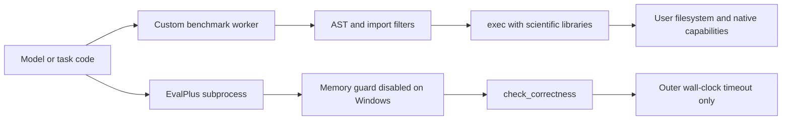
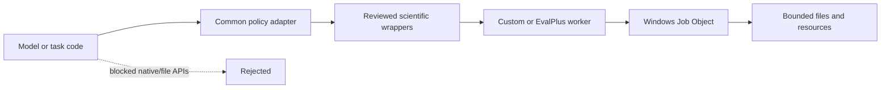
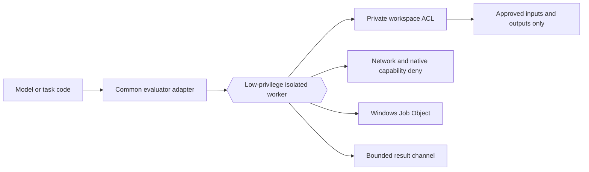

# Security Hardening Proposal: Enforced boundary for generated evaluation code

## Decision

We need one security owner for both generated-code paths. The custom benchmark currently combines AST checks, import filtering, a temporary directory, and a Windows Job Object; EvalPlus uses a separate subprocess path that disables memory enforcement on Windows. That split is the structural condition behind the two findings. I recommend Option 2, the OS-isolated evaluator, while shipping the core pieces of Option 1 immediately as containment.

## Executive Recommendation

There are two options. **Option 1: Tactical capability reduction** tightens the in-process API and restores EvalPlus limits with a Windows Job Object. **Option 2: OS-isolated evaluator** puts both paths behind a low-privilege worker boundary with private workspace ACLs, denied network/native capabilities, and shared resource enforcement. Option 1 is faster and preserves more of the current execution shape. Option 2 is the safer long-term choice because it limits the blast radius if the Python interpreter or a third-party scientific library is escaped.

## Evidence

| Evidence | Finding | What it establishes |
| --- | --- | --- |
| `csf_57dcc81118eb3aba784ea723` | Generated-code sandbox can escape through allowlisted native-loader APIs | `numpy` and other native-capable packages are available to `exec()` code, while the Job Object controls resources rather than capabilities. |
| `csf_3b9d51bdd18255fa689920a9` | Windows EvalPlus execution disables memory enforcement for generated solutions | `EVALPLUS_MAX_MEMORY_BYTES=-1` and a no-op signal timer remove the intended controls; only the outer wall-clock timeout remains. |

I inspected `src/sandbox_worker.py:31-139`, `src/custom_benchmark.py:1224-1281`, and `src/evalplus_subset_eval.py:27-145`. The important inference is not simply that two lines are unsafe. It is that security policy is encoded in separate wrappers around two forms of untrusted execution, so compatibility fixes can remove a control in one path without a shared owner noticing.

## Current Design And Failure Mode

The parent serializes generated code into a worker request. The worker permits several broad scientific packages, performs a limited AST check, and calls `exec()`. The temporary working directory helps with accidental output placement, but it is not a filesystem boundary. The Windows Job Object limits memory and process count, but it does not change the worker's identity or deny native, filesystem, or network authority.

EvalPlus follows a different path. It receives generated solutions through a samples file, disables its memory query to avoid a Windows dependency failure, and replaces signal timers with no-ops. The outer `subprocess.run(timeout=...)` is useful, but it cannot substitute for a memory limit or guarantee that all child processes are terminated.

## Desired Invariants

- Generated code cannot access arbitrary host files, ambient credentials, native loaders, or network capabilities.
- Every generated-code process and descendant has a Windows-enforced memory, process-tree, and wall-clock bound.
- Windows compatibility workarounds preserve the security property through an equivalent control.
- Both evaluator entry points expose the same failure, cleanup, and telemetry contract.
- The benchmark API remains stable even if the evaluator implementation changes.

## Constraints And Non-Goals

We will keep Windows as the primary supported platform and will not rely on `signal.alarm`, `fork`, or other POSIX-only mechanisms. We have no measured throughput or memory budget, so startup and serialization costs must be measured. We are not redesigning benchmark semantics or proving third-party library safety. We are also not treating import filtering as a sufficient sandbox after the change.

## Before Architecture

The two paths have different controls and different failure semantics. That is why a fix in one runner will not automatically protect the other.

## Options

### Option 1: Tactical capability reduction

We remove direct imports of native-capable packages from hostile code and replace them with a deliberately small wrapper API for the operations the benchmark actually needs. In parallel, we launch EvalPlus suspended, assign the process to the existing Windows Job Object, apply memory and process-tree limits, and then resume it. This option preserves the current parent/child architecture and can be delivered incrementally.

The strongest case for Option 1 is compatibility with the current repository: we can keep the custom benchmark entry point and add targeted tests without introducing a new deployment primitive. What gives me pause is that in-process Python remains a capability boundary. A newly exposed library method or interpreter behavior could recreate the escape, and the wrapper API will require ongoing review as benchmark fixtures evolve.

| Change | Before | After | Security consequence | Cost |
| --- | --- | --- | --- | --- |
| API surface | Broad scientific imports | Reviewed wrapper functions | Fewer direct escape routes | Wrapper maintenance and compatibility work |
| EvalPlus limits | Memory disabled on Windows | Job Object memory/process limits | Resource exhaustion is bounded | Windows launcher complexity |
| Ownership | Separate controls | Shared policy adapter | Less control drift | Refactoring two entry points |

The residual risk is material: this is a stronger in-process design, not a complete sandbox. We should use it as the immediate containment step and keep the finding open until the OS boundary is addressed or the threat model explicitly accepts the residual risk.

### Option 2: OS-isolated evaluator

We introduce a common evaluator worker whose process identity, workspace ACLs, network policy, Job Object limits, timeout, and cleanup are owned in one place. The worker receives only the task payload and an explicitly assigned input/output root. Generated code may still use wrappers, but those wrappers become defense in depth rather than the primary boundary. Both custom benchmark and EvalPlus call the worker through a stable adapter.

The attractive part is blast-radius reduction. If a package exposes a native loader despite our review, the worker should still lack the authority needed to damage the user's files or reach the network. We also gain one place to handle process-tree termination and to preserve the memory guarantee that EvalPlus currently loses on Windows. The cost is real: process startup, serialization, Windows identity/ACL provisioning, and more involved diagnostics. We should address that with a warm worker option and a feature-flagged rollout rather than weakening the boundary.

| Change | Before | After | Security consequence | Cost |
| --- | --- | --- | --- | --- |
| Authority | Benchmark user's ambient identity | Dedicated low-privilege worker identity | Escape blast radius is reduced | Provisioning and ACL operations |
| Resources | EvalPlus memory guard disabled | Shared Job Object and timeout policy | Memory and process exhaustion are bounded | Startup and process-management overhead |
| Network/native access | Not denied by the worker boundary | Explicitly denied or absent | Native-loader escape no longer equals host compromise | Platform-specific setup and self-tests |
| Integration | Two evaluator paths | One adapter and worker protocol | Security policy is easier to keep consistent | Migration and IPC compatibility |

Option 2 is the recommendation under the supplied threat model. Option 1 becomes preferable only if the environment cannot support a low-privilege/isolated worker and the project explicitly accepts residual in-process risk. Even then, the EvalPlus Job Object work remains mandatory.

## Comparison

| Dimension | Option 1: Tactical capability reduction | Option 2: OS-isolated evaluator |
| --- | --- | --- |
| Security | Improves known routes; residual interpreter/library escape remains | Strongest blast-radius reduction; worker interface remains trusted |
| Performance | Likely closest to current path; wrapper overhead unmeasured | Startup/IPC overhead likely; warm worker may recover throughput |
| Memory | Adds EvalPlus cap; wrapper copies must be controlled | Adds worker baseline but bounds total growth |
| Reliability | Smaller API may reject fixtures | Failure isolation improves; IPC/cleanup become new failure modes |
| Operability | Lower deployment burden, higher allowlist drift risk | Higher provisioning and observability burden |
| Migration | Incremental and easy to roll back | More components, but stable benchmark adapters can limit disruption |

## Recommendation

I recommend Option 2, delivered in two stages: first restore EvalPlus process/memory limits and block the most obvious native-loader APIs; then move both evaluators behind the isolated worker. We should choose Option 1 as the final design only if a measured platform constraint makes OS isolation infeasible and the security owner signs off on the residual risk.

## Evidence Coverage And Residual Risk

| Evidence | Coverage | Residual risk |
| --- | --- | --- |
| `csf_57dcc81118eb3aba784ea723` — sandbox native-loader escape | Option 1 mitigates; Option 2 addresses | Option 1 still trusts in-process Python and dependencies. |
| `csf_3b9d51bdd18255fa689920a9` — EvalPlus memory enforcement disabled | Both options address if the Windows Job Object is applied before resume | External EvalPlus internals remain outside this repository and need runtime verification. |

## Migration And Rollout

We should first add a feature flag and telemetry, without changing benchmark results. The first rollout stage applies the Job Object to EvalPlus and records limit hits, child exit codes, and cleanup results. The second stage runs the custom benchmark through the common worker for a small fixture subset. We then expand to full suites after score parity and resource benchmarks pass. Rollback means switching the evaluator adapter to the tactical runner, not removing the resource limits.

## Validation Plan

- Static: verify the final import/wrapper surface and all evaluator subprocess creation sites.
- Escape tests: attempt file reads/writes outside the assigned root, native-library loading, process creation, network access, credential reads, and interpreter recovery.
- Resource tests: allocate memory, spawn descendants, emit large output, and exceed wall-clock limits; verify the complete tree is terminated.
- Compatibility: run representative DS1000, HumanEval+, and MBPP+ fixtures and compare scores, failure classifications, throughput, p95 latency, and peak RSS.
- Lifecycle: interrupt the parent, kill the worker, corrupt the result channel, and confirm temporary directories and child processes are cleaned up.

## Implementation Work Packages

1. Refresh the source revision and confirm the scan's affected paths have not drifted.
2. Define the evaluator protocol, approved roots, output schema, and limit configuration.
3. Implement a Windows Job Object launcher that starts suspended, assigns the process tree, applies memory/process limits, resumes, and cleans up deterministically.
4. Apply the launcher to EvalPlus and add Windows regression tests.
5. Reduce the custom worker to a reviewed wrapper API and add adversarial escape tests.
6. Move both pipelines behind the common isolated worker and benchmark against the baseline.
7. Remove the legacy diagnostic path or restrict it to an explicit development-only mode after acceptance.

## Open Questions

- Which Windows isolation primitive is supportable in the actual deployment environment?
- What direct scientific APIs must remain compatible with existing fixtures?
- What startup, throughput, peak-memory, and p95-latency thresholds define acceptance?
- What external guarantees does the installed EvalPlus version provide after the wrapper changes?
